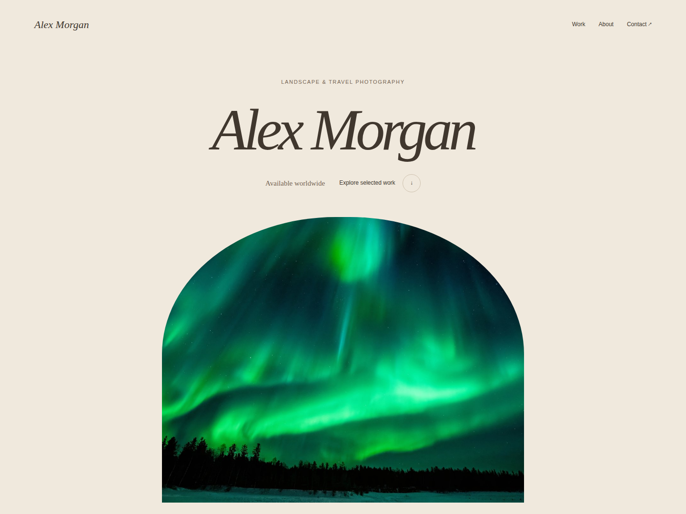
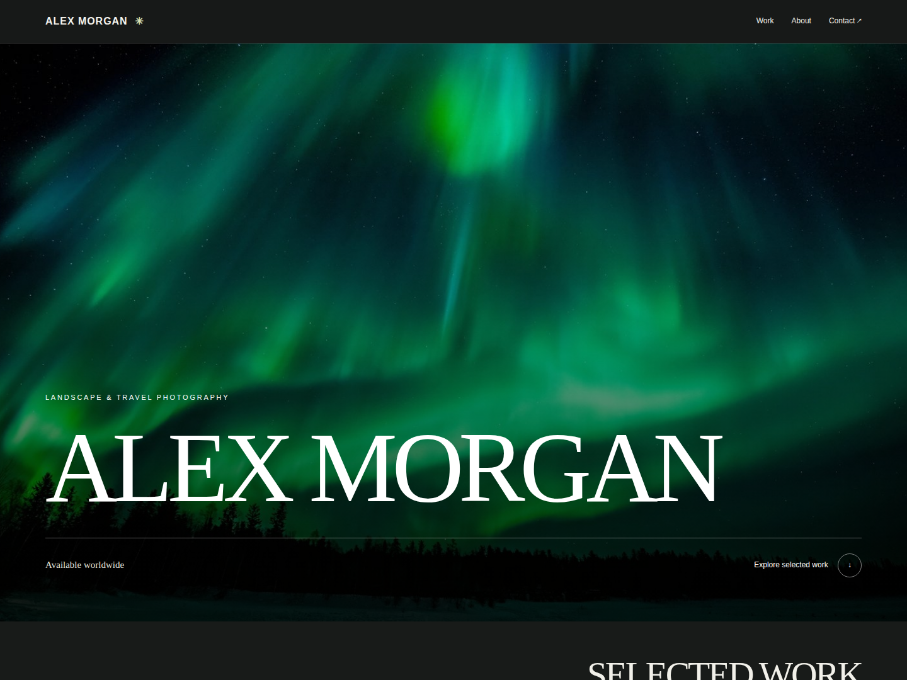
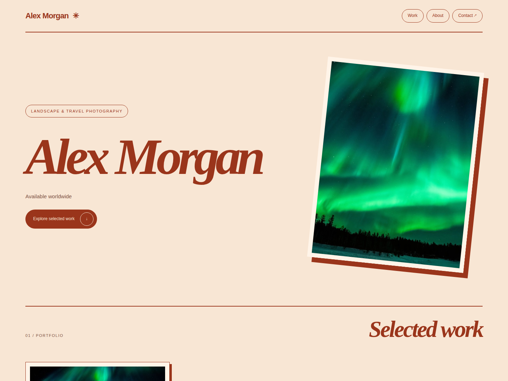
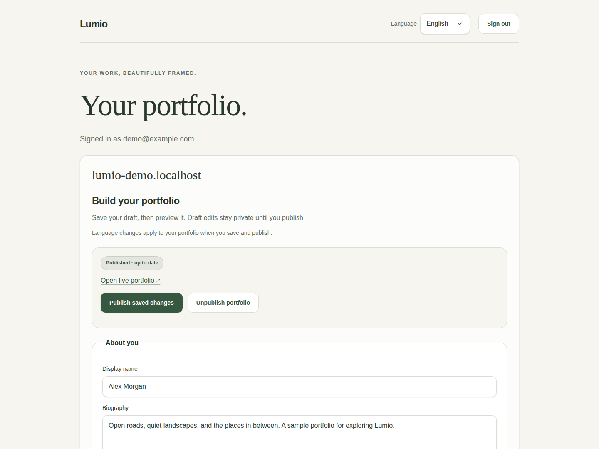

<!-- markdownlint-disable -->

	

<h1 align="center">Lumio</h1>

<i>Your work, beautifully framed.</i>

    
    
    

<!-- markdownlint-enable -->

Lumio is a portfolio website builder for photographers. Create a polished
portfolio, showcase selected work, and share it through a personal website.

## ✨ Features

- Upload JPEG, PNG, or WebP photographs and organize them in a portfolio.
- Add a biography, services, prices, and contact links.
- Choose a Gallery, Editorial, or Studio layout and preview drafts before
  publishing.
- Publish a responsive portfolio on a personal subdomain.
- Manage access with invitations and recover passwords through an operator.

## 📸 Screenshots

<!-- markdownlint-disable MD013 -->

| Gallery                                            | Editorial                                              |
|----------------------------------------------------|--------------------------------------------------------|
|  |  |

<!-- markdownlint-enable MD013 -->

<!-- markdownlint-disable MD013 -->

| Studio                                           | Portfolio editor                                 |
|--------------------------------------------------|--------------------------------------------------|
|  |  |

<!-- markdownlint-enable MD013 -->

See [photo credits and screenshot licenses](docs/screenshots/CREDITS.md).

## 📚 Documentation

- [Architecture](docs/architecture.md), [configuration](docs/configuration.md),
  [development](docs/development.md)
- [Deployment](docs/deployment.md) and
  [pilot operations](docs/pilot-operations.md)
- [Changelog](CHANGELOG.md)

## 📜 License

Distributed under the MIT License. See [License](/LICENSE) for details.
